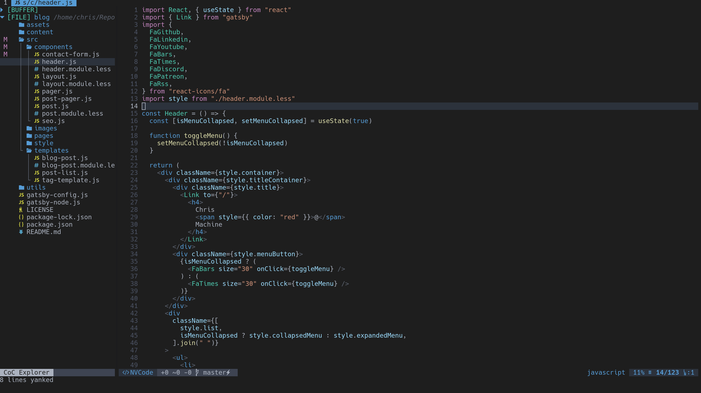

# NVCode Colorscheme



**Included Themes**

- nvcode (basically just dark+)
- onedark (still in development)
- nord (coming soon)

This Colorscheme requires treesitter and Neovim > 0.5 to work and look good

## Installing

With `Vim-plug`

```
Plug 'christianchiarulli/nvcode-color-schemes.vim'
Plug 'nvim-treesitter/nvim-treesitter'
```

## Configuring

Just pop this in your `init.vim`

```
lua << EOF
require'nvim-treesitter.configs'.setup {
  ensure_installed = "all", -- one of "all", "maintained" (parsers with maintainers), or a list of languages
  highlight = {
    enable = true,              -- false will disable the whole extension
    disable = { "c", "rust" },  -- list of language that will be disabled
  },
}
EOF
```

And put this in your `init.vim`

```
let g:nvcode_termcolors=256

syntax on
colorscheme nvcode " Or whatever colorscheme you make


" checks if your terminal has 24-bit color support
if (has("termguicolors"))
    set termguicolors
    hi LineNr ctermbg=NONE guibg=NONE
endif
```

## Contributing

- Create a yaml file
- Fill it with all the highlight groups you want
- Run the generate script `generate <colorscheme name>.yml`
- Put the colorscheme in the `colors` directory
- Create a PR

These are the highlight groups you wanna pay the most attention to.

```
" Misc
highlight TSError guifg=#F44747
highlight TSPunctDelimiter guifg=#ABB2BF
highlight TSPunctBracket guifg=#ABB2BF
highlight TSPunctSpecial guifg=#ABB2BF

" Constants
highlight TSConstant guifg=#DCDCAA
highlight TSConstBuiltin guifg=#569CD6
" Not sure about this guy
highlight TSConstMacro guifg=#4EC9B0
highlight TSString guifg=#CE9178
highlight TSStringRegex guifg=#CE9178
highlight TSString guifg=#CE9178
highlight TSStringEscape guifg=#D7BA7D
highlight TSCharacter guifg=#CE9178
highlight TSNumber guifg=#B5CEA8
highlight TSBoolean guifg=#569CD6
highlight TSFloat guifg=#B5CEA8
highlight TSAnnotation guifg=#DCDCAA
highlight TSAttribute guifg=#FF00FF
highlight TSNamespace guifg=#FF00FF


" Functions
" highlight TSFuncBuiltin guifg=#4EC9B0
highlight TSFuncBuiltin guifg=#DCDCAA
highlight TSFunction guifg=#DCDCAA
highlight TSFuncMacro guifg=#DCDCAA
highlight TSParameter guifg=#9CDCFE
highlight TSParameterReference guifg=#9CDCFE
highlight TSMethod guifg=#DCDCAA
highlight TSField guifg=#9CDCFE
highlight TSProperty guifg=#9CDCFE
highlight TSConstructor guifg=#4EC9B0

" Keywords
highlight TSConditional guifg=#C586C0
highlight TSRepeat guifg=#C586C0
highlight TSLabel guifg=#FF00FF
" Does not work for yield and return they should be diff then class and def
highlight TSKeyword guifg=#569CD6
highlight TSKeywordFunction guifg=#FF00FF
highlight TSKeywordOperator guifg=#569CD6
highlight TSOperator guifg=#ABB2BF
highlight TSException guifg=#C586C0
highlight TSType guifg=#4EC9B0
highlight TSTypeBuiltin guifg=#FF00FF
highlight TSStructure guifg=#FF00FF
highlight TSInclude guifg=#C586C0

" Variable
highlight TSVariable guifg=#9CDCFE
highlight TSVariableBuiltin guifg=#9CDCFE

" Text
highlight TSText guifg=#FF00FF
highlight TSStrong guifg=#FF00FF
highlight TSEmphasis guifg=#FF00FF
highlight TSUnderline guifg=#FF00FF
highlight TSTitle guifg=#FF00FF
highlight TSLiteral guifg=#FF00FF
highlight TSURI guifg=#FF00FF

" Tags
highlight TSTag guifg=#569CD6
highlight TSTagDelimiter guifg=#5C6370
```

## Credit

The generate script comes from this repo: https://github.com/felipec/vim-felipec
